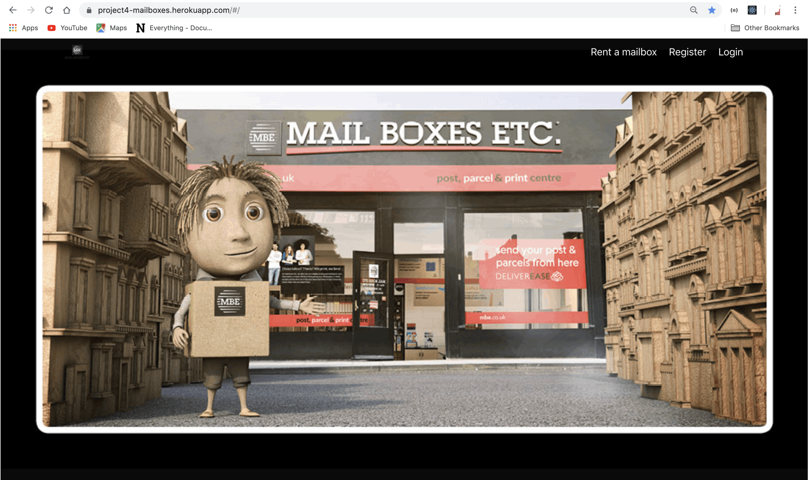

## Project 4: Mailboxes mail recorder

Mailboxes mail recorder is my fourth and last project at GA.
Mail recorder is an idea that comes from my previous work experience at Mail Boxes Etc. franchise where the core businesses is postal boxes rental.

### Overview

I am particularly proud of it for two reasons: It was interesting to see how Python, Django, SQl, React & JavaScript worked with each other; moreover, instead of making an ordinary website, I came up with an office application where the frontend helps the customers. Finally the backend makes work  for the retailer by organising and tracking the customers mail.
I have started designing wireframes, then decided deadlines and the MVP features.

From the frontend the customer can register and rent mailboxes to receive mail at the shop address. The customers personal profile section can be used to  update their personal details, access their rental details and check for possible mail received, collected or not.

Here is the link to my project:
[Mailboxes mail recorder](https://project4-mailboxes.herokuapp.com/#/profile)

### Future content

* Automate the email service for the customer.
* More interesting layout.

### Technologies Used

* Django
* SQL
* Python
* JavaScript (ES6)
* Git
* GitHub
